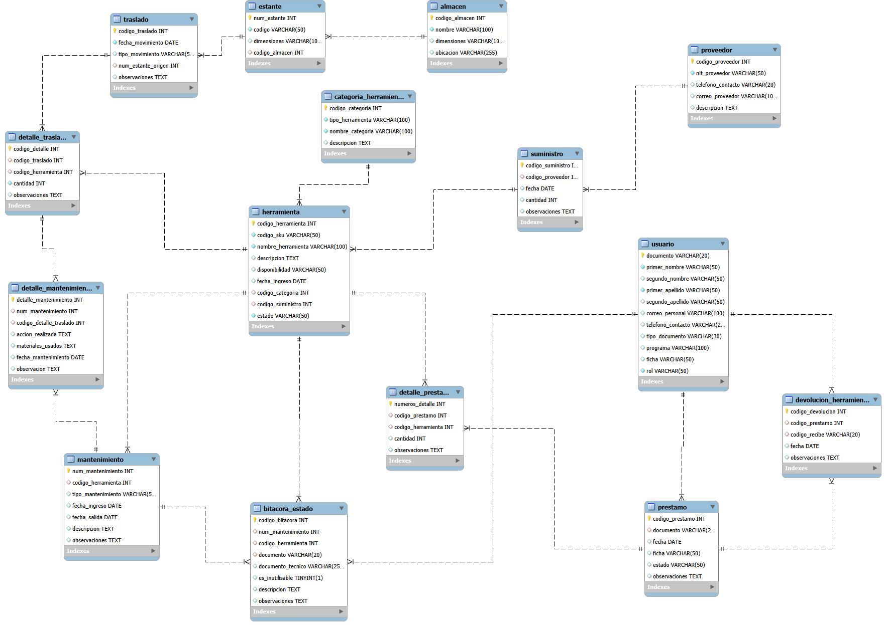

# Inventario-Mina
Sistema de gestión de inventario y mantenimiento para equipos y herramientas de una operación minera. Cubre tres necesidades del negocio: control de existencias, préstamos de herramientas a trabajadores, y trazabilidad completa del ciclo de mantenimiento de cada activo (desde que se reporta una falla hasta su cierre). 

